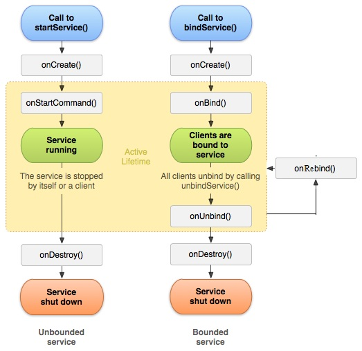

# Les Services - Android Studio

## Introduction

**Qu'est ce qu'un Service ?**

Un service est un "composant" qui va permettre à une application d'exécuter des tâches en arrière plan.
Un service peut communiquer avec d'autres composant android.
Un service possède un cycle de vie comme une activité mais pas d'interface graphique.

**Exemples concret d'utilisation ?**

- Exemple 1 :
Envoyer une notification pour un rappel d'événement à tel date.
- Exemple 2 : 
Lire une séquence audio en arrière plan.

---

## Les différents types de services

**Différents types de service**

- Services locaux
- Sercices distants

**Cycles de vie**

> Gauche : Service Local
> Droite : Service Distant

**Différences**

Un service local est lancé lorsqu'il est appelé par une activité. Il s'arrête lorsque l'opération pour laquelle il a été lancé se termine. En revanche il ne s'arrêtera pas lorsque l'activité s'arrête.

Un service distant permet une interaction de type "client-serveur". La persistance du service est du coup assuré par le paramètre 'connexion' de la fonction :

> bindService(Intent MonService, ServiceConnection connexion, int flag)

**Les flags**

* START_NOT_STICKY : En cas de "kill" du service par le système, il n'est pas recrée
* START_STICKY : En cas de "kill" du service par le système, il sera recrée mais le paramètre Intent sera null.
* START_REDELIVER_INTENT : En cas de "kill" du service par le système, il sera recrée à l'identique.

---

## Création d'un service 

---

## Webographie

- [Cours openclassroom](https://openclassrooms.com/courses/creez-des-applications-pour-android/les-services-3)
- [Tutoriel Android Studio developpez.com](http://vogella.developpez.com/tutoriels/android/developpement-androidstudio-eclipse/)
- [Schema cycle de vie](http://4.bp.blogspot.com/-lpA251Fsi0w/T7-WEcrYssI/AAAAAAAAAeQ/n8tsL2I_l-o/s1600/service_lifecycle_rdc.jpg)
