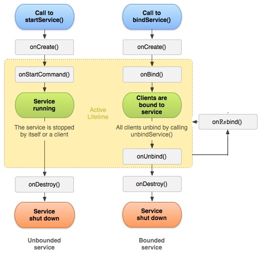
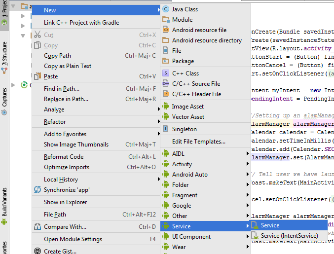

# Les Services - Android Studio

**JF Durand - novembre 2016**

Les slides du TP sont disponible ici : [https://whispyy.github.io/TP-Services](https://whispyy.github.io/TP-Services)


## Introduction

**Qu'est ce qu'un Service ?**

Un service est un "composant" qui va permettre à une application d'exécuter des tâches en arrière plan.
Un service peut communiquer avec d'autres composant android.
Un service possède un cycle de vie comme une activité mais pas d'interface graphique.

**Exemples concret d'utilisation ?**

- Exemple 1 :
Envoyer une notification pour un rappel d'événement à tel date.
- Exemple 2 : 
Lire une séquence audio en arrière plan.

---

## Les différents types de services

**Différents types de service**

- Services locaux
- Sercices distants

**Cycles de vie**

<p align="center">
    
</p>


> Gauche : Service Local

> Droite : Service Distant

**Différences**

Un service local est lancé lorsqu'il est appelé par une activité. Il s'arrête lorsque l'opération pour laquelle il a été lancé se termine. En revanche il ne s'arrêtera pas lorsque l'activité s'arrête.

Un service distant permet une interaction de type "client-serveur". La persistance du service est du coup assuré par le paramètre 'connexion' de la fonction :

```bindService(Intent MonService, ServiceConnection connexion, int flag)```


**Les flags**

* START_NOT_STICKY : En cas d'arrêt du service par le système, il n'est pas recrée
* START_STICKY : En cas d'arrêt du service par le système, il sera recrée mais le paramètre Intent sera null.
* START_REDELIVER_INTENT : En cas d'arrêt du service par le système, il sera recrée à l'identique.

**Les deux façons d'implémenter un service**

* Service : permet de créer un service ou le code sera executé dans le "thread" principale.
* IntentService : permet de créer un service et gère une file d'attente des requête par ordre d'arrivée à chaque appel de startService().

---

## Création d'un service 

### 1. Récupération des sources

Télécharger l'archive ici : [https://github.com/whispyy/TP-Services/tree/local_service_initial](http://github.com/whispyy/TP-Services/tree/local_service_initial)

Ou clonez le dépot depuis mon git : [https://github.com/whispyy/TP-Services](https://github.com/whispyy/TP-Services) et basculez sur la branche : local_service_initial

### 2. Analyse de l'activité

L'activité est composée de deux boutons : Start et Cancel.
Start permet de lancer le service et Cancel de l'annuler.

```java
    @Override
    public void onCreate(Bundle savedInstanceState) {
        super.onCreate(savedInstanceState);
        setContentView(R.layout.activity_main);
        Button buttonStart = (Button) findViewById(R.id.startalarm);
        Button buttonCancel = (Button) findViewById(R.id.cancelalarm);
        buttonStart.setOnClickListener(new Button.OnClickListener() {
            @Override
            public void onClick(View arg0) {

                Intent myIntent = new Intent(MainActivity.this, MyService.class);
                pendingIntent = PendingIntent.getService(MainActivity.this, 0, myIntent, 0);

                //Setting up an alamManager
                AlarmManager alarmManager = (AlarmManager) getSystemService(ALARM_SERVICE);
                Calendar calendar = Calendar.getInstance();
                calendar.setTimeInMillis(System.currentTimeMillis());
                calendar.add(Calendar.SECOND, 15);
                alarmManager.set(AlarmManager.RTC_WAKEUP, calendar.getTimeInMillis(), pendingIntent);

                // Tell user we have launched the service
                Toast.makeText(MainActivity.this, "Start Alarm", Toast.LENGTH_SHORT).show();
            }
        });
        buttonCancel.setOnClickListener(new Button.OnClickListener() {
            @Override
            public void onClick(View arg0) {

                AlarmManager alarmManager = (AlarmManager) getSystemService(ALARM_SERVICE);
                alarmManager.cancel(pendingIntent);
                // Tell the user about what we did.
                Toast.makeText(MainActivity.this, "Cancel!", Toast.LENGTH_LONG).show();
            }
        });
    }
```

On remarque ici que le service est appelé une première fois par l'intermédiaire d'un Intent :

```java
Intent myIntent = new Intent(MainActivity.this, MyService.class);
```

Puis définitement appelé ici :

```java
alarmManager.set(AlarmManager.RTC_WAKEUP, calendar.getTimeInMillis(), pendingIntent);
```

Il faut imaginer ici que tout cela revient à faire une programmation d'un délai suivi d'un appel à ```startService(myIntent)``` .


### 3. Création d'un service local

#### 3.1 Initialisation du service

Il faut effectuer la maneuvre suivante :

* Clic droit sur app
* Naviguer jusque Service
* Puis cliquer sur Service dans le sous-menu

<p align="center">
    
</p>

Nommez votre service MyService étant donné que c'est ainsi qu'il est appelé dans l'activité de l'archive.


#### 3.2 Remplir le service

**L'objectif est de créer un service ou l'on va pouvoir visualiser le cycle de vie d'un service.**

Pour cela je propose de commencer par implémenter des toasts sur chaque fonction du service en question. 
Je vous suggère également d'implémenter les return de la façon suivante.

```java
@Override
    public void onCreate() {
        // TODO Auto-generated method stub
        Toast.makeText(this, "Service.onCreate()", Toast.LENGTH_LONG).show();
    }


    @Override
    public IBinder onBind(Intent intent) {
        Toast.makeText(this, "Service.onBind()", Toast.LENGTH_LONG).show();
        return null;
    }


    @Override
    public void onDestroy() {
        super.onDestroy();
        Toast.makeText(this, "Service.onDestroy()", Toast.LENGTH_LONG).show();
    }

    @Override
    public int onStartCommand(Intent intent, int flag, int startId){
        super.onStartCommand(intent,flag,startId);
        Toast.makeText(this, "Service.onStartCommand()",Toast.LENGTH_LONG).show();
        //on retourne le flag comme évoqué dans l'introduction
        return START_NOT_STICKY;
    }

    @Override
    public boolean onUnbind(Intent intent) {
        Toast.makeText(this, "Service.onUnbind()", Toast.LENGTH_LONG).show();
        return super.onUnbind(intent);
    }
```

> Attention :
>
> Même si nous créons un service local, il est nécéssaire de ré-écrire les fonctions d'un service distant à savoir :
> onBind(Intent intent) ET onUnbind(Intent intent)

Arrivé à ce stade vous pouvez exécuter l'application et la tester sur votre smartphone android. 
Vous devriez apercevoir un toast pour chaque action du cycle de vie du service.

N'oubliez pas que dans les paramètres du services vous pouvez "forcer l'arrêt" du service étant donné que nous n'avons pas implémenté d'arrêt automatique de celui-ci. Je vous invite par ailleurs à modifier le paramètre return de la méthode onStartCommande() pour observer les différents comportements évoqué dans l'introduction.

### 3.3 Implémenter une notification

Comme nous l'avons vu dans l'introduction un service permet d'éxécuter toute sorte de tâches en arrière plan.
L'une des tâches les plus facile à implémenter étant donné le temps imparti est la notification. 
Pour cela nous allons implémenter une notification dans la commande onStartCommande() comme suite :

```java
@Override
    public int onStartCommand(Intent intent, int flag, int startId){
        //Here must be the code to execute
        final NotificationCompat.Builder mBuilder = new NotificationCompat.Builder(this);
        mBuilder.setSmallIcon(R.drawable.notification_icon);
        mBuilder.setContentTitle("Service");
        mBuilder.setContentText("Execution en cours");
        final int notificationID = 1;
        final NotificationManager mNotificationManager =
                (NotificationManager) getSystemService(Context.NOTIFICATION_SERVICE);
        mNotificationManager.notify(notificationID, mBuilder.build());

        super.onStartCommand(intent,flag,startId);
        Toast.makeText(this, "Service.onStartCommand()",Toast.LENGTH_LONG).show();
        return START_NOT_STICKY;
    }
```

## 4. Différence entre un service local et distant

le service distant va implémenter les fonctions suivantes :

```java
    @Override
    public void onCreate() {}

    @OVerride
    public IBinder onBind(Intent intent) {}

    @Override
    public boolean onUnbind(Intent intent) {}

    //Eventuellement une fonction onRebind(Intent intent);

    @Override
    public void onDestroy() {}
```

Ce service sera appelé par une méthode ```bindService(Intent nomService, ServiceConnection connexion, int flag)``` .
La connexion est gérée via le composant ServiceConnection d'Android.

---

## Conclusion

Nous avons vu comment implémenter succintement un Service local. Cependant si ce sujet vous intéresse je vous invite à aller voir le cours openclassroom (lien disponible dans la webographie).

En effet vous pouvez être intéresser d'implémenter un service via :

* un IntentService
* un service distant

L'archive contenant les sources finales se trouve ici : [https://github.com/whispyy/TP-Services/tree/local_service_final](https://github.com/whispyy/TP-Services/tree/local_service_final)


---

## Webographie

- [Cours openclassroom](https://openclassrooms.com/courses/creez-des-applications-pour-android/les-services-3)
- [Tutoriel Android Studio developpez.com](http://vogella.developpez.com/tutoriels/android/developpement-androidstudio-eclipse/)
- [Schema cycle de vie](http://4.bp.blogspot.com/-lpA251Fsi0w/T7-WEcrYssI/AAAAAAAAAeQ/n8tsL2I_l-o/s1600/service_lifecycle_rdc.jpg)
